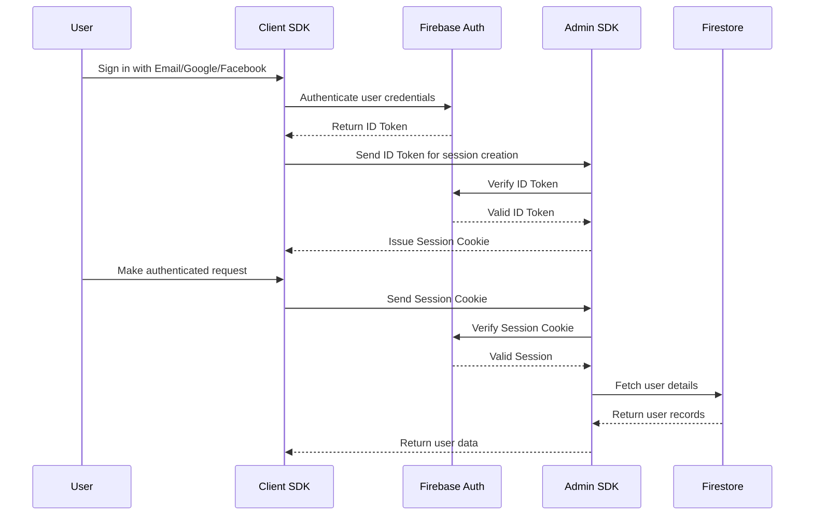
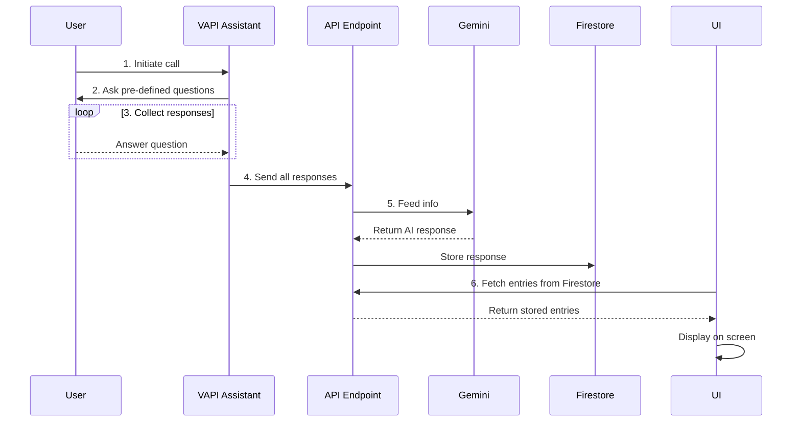

# AI InterviewPrep - an AI Interview Preparation Platform

## About the Project

A **Next.js**-powered mock interview platform offering real-time AI interviews, personalized feedback, and dynamically curated questions based on your choices. Ace your next interview!

#### The project uses the following technologies:

-  React framework with built-in SSR, static-export, file-based routing, and image optimization.  
-  Utility-first CSS for rapid UI prototyping without leaving your markup.  
-  Lightweight, type-safe API framework for defining endpoints and request/response schemas with minimal boilerplate.  
-  Managed backend services (Auth, Firestore, Hosting, Functions) for quick setup and horizontal scalability.  
-  Accessible, customizable React components built on Radix and Tailwind—perfect for design consistency.  
-  TypeScript-first schema validation to ensure data integrity at compile- and runtime.  
-  Advanced LLM integration for context-aware interview simulations and real-time feedback.  
-  Statically-typed JavaScript superset for safer code and better editor support.  
-  Configurable linter enforcing code standards and catching potential errors early.  
-  Next-generation bundler optimized for lightning-fast HMR and incremental builds.  
-  Text-based diagramming engine for generating flowcharts, sequence diagrams, class diagrams, and more directly from simple markup.
-  Frontend cloud platform for deploying, previewing, and scaling modern web applications with seamless Git integration and edge performance.
-  Lightweight TypeScript SDK from Vercel for building conversational AI apps using streaming LLM outputs, function calling, and tool integration.

- **…and more**: State management, test runners, CI/CD tools, performance monitoring, and other enhancements.

## Firebase Authentication

## Gemini AI integration

### LLM Model used:
**gemini-2.0-flash**: Gemini 2.0 Flash delivers next-gen features and improved capabilities, including superior speed, built-in tool use, multimodal generation, and a 1M token context window.



### AI Models used:
Voice Assistant:
- gpt-4o cluster by OpenAI
- claude-sonnet 3.5 by Anthropic

Transcriber (Speech to Text):
- nova-2 by deepgram

Interview Generation and Feedback
- gemini-2.0-flash-001

## Getting Started

1. Install dependencies and start development server:

   ```bash
   npm install
   npm run dev
   # or
   yarn
   yarn dev
   # or
   pnpm
   pnpm dev
   ```

2. Open [http://localhost:3000](http://localhost:3000) to see your app.

3. Edit `app/page.tsx`—changes auto-reload in the browser.

This setup also uses [`next/font`](https://nextjs.org/docs/app/building-your-application/optimizing/fonts) to optimize loading of the **Geist** font from Vercel.