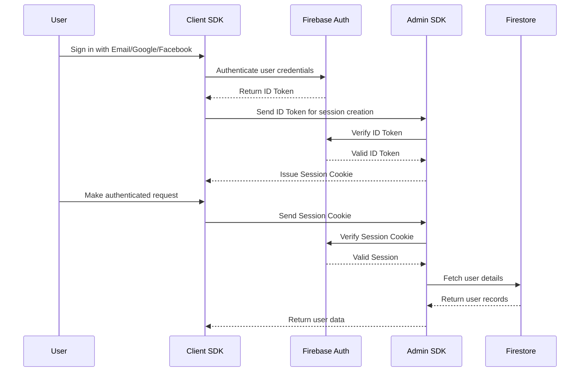

# AI Mock Interview Platform

## About the Project

A **Next.js**-powered AI mock-interview platform that combines rapid front-end development with intelligent, AI-driven back-ends:

-  React framework with built-in SSR, static-export, file-based routing, and image optimization.  
-  Utility-first CSS for rapid UI prototyping without leaving your markup.  
-  Lightweight, type-safe API framework for defining endpoints and request/response schemas with minimal boilerplate.  
-  Managed backend services (Auth, Firestore, Hosting, Functions) for quick setup and horizontal scalability.  
-  Accessible, customizable React components built on Radix and Tailwind—perfect for design consistency.  
-  TypeScript-first schema validation to ensure data integrity at compile- and runtime.  
-  Advanced LLM integration for context-aware interview simulations and real-time feedback.  
-  Statically-typed JavaScript superset for safer code and better editor support.  
-  Configurable linter enforcing code standards and catching potential errors early.  
-  Next-generation bundler optimized for lightning-fast HMR and incremental builds.  
-  Text-based diagramming engine for generating flowcharts, sequence diagrams, class diagrams, and more directly from simple markup.
- **…and more**: State management, test runners, CI/CD tools, performance monitoring, and other enhancements.

## Firebase Authentication



## Getting Started

1. Install dependencies and start development server:

   ```bash
   npm install
   npm run dev
   # or
   yarn
   yarn dev
   # or
   pnpm
   pnpm dev
   ```

2. Open [http://localhost:3000](http://localhost:3000) to see your app.

3. Edit `app/page.tsx`—changes auto-reload in the browser.

This setup also uses [`next/font`](https://nextjs.org/docs/app/building-your-application/optimizing/fonts) to optimize loading of the **Geist** font from Vercel.

## Learn More

- **Next.js Documentation**: https://nextjs.org/docs  
- **Interactive Tutorial**: https://nextjs.org/learn  
- **GitHub Repo**: https://github.com/vercel/next.js

## Deploy on Vercel

Deploy with zero-config on Vercel:

[](https://vercel.com/new?utm_medium=default-template&filter=next.js&utm_source=create-next-app&utm_campaign=create-next-app-readme)

See [Next.js deployment docs](https://nextjs.org/docs/app/building-your-application/deploying) for more details.
